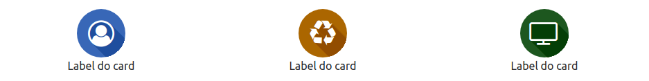

# iconcardscss v 0.1

Os Icon Cards tem por objetivo apresentar um cartão ou um conjunto de cartões. Estes cartões podem ter cores,
tamanhos e formatos diferentes. O conteúdo dos cards podem ser letras ou também ícones, como mostram os exemplos abaixo. Os cartões podem ser usados como links <code>&lt;a&gt;</code> ou como blocos <code>&lt;div&gt;</code>. 
Para usar como link, use a tag HTML <code>&lt;a href="#" class="icon-card"&gt;&lt;/a&gt;</code>

### Recursos
* Tamanhos: 
  * x: 40x40;
  * 2x: 70x70 px;
  * 3x: 100x100 px;
  * 4x: 130x 130 px;
* Formatos
  * Quadrado (padrão)
  * Arredondado
  * Circular
* Sombras
  * Sombra no texto
  * Sombra no cartão
  * _Blur_ no texto
  * _Blur_ no cartão
* Posicionamento
  * Centralizado

### Exemplos
#### Lista de cartões

```html
<div class="icon-cards inline">
    <a class="icon-card">...</a>
</div>
```
#### Tamanhos

```html
<!-- Uma lista com cartões de tamanhos diferentes -->
<div class="icon-cards inline">
    <div class="icon-card">...</div>
    <div class="icon-card icon-card-2x">...</div>
    <div class="icon-card icon-card-3x">...</div>
    <div class="icon-card icon-card-4x">...</div>
</div>

<!-- Uma lista de cartões com o mesmo tamanho -->
<div class="icon-cards icon-cards-2x inline">
    <div class="icon-card">...</div>
    <div class="icon-card">...</div>
    <div class="icon-card">...</div>
    <div class="icon-card">...</div>
</div>
```
#### Formato

```html
<div class="icon-card">...</div>
<div class="icon-card rounded">...</div>
<div class="icon-card circle">...</div>
```
#### Sombras

```html
<div class="icon-card">...</div>
<div class="icon-card rounded">...</div>
<div class="icon-card circle">...</div>
```
#### Centralizado

```html
<div class="icon-cards">
    <div class="center">
        <a class="icon-card">...</a>
        <p>...</p>
    </div>
</div>
```
### Próximos recursos
* radial-gradient
* texto ao lado do cartão
* bordas para os cartões
* tipos de margem: fina, média ou grossa
* Cores para o blur
* Cores para o text-blur
* box-shadow também com long shadow
* box-shadow gradient
* text-shadow gratient
* Animações: 
  * text-shadow:hover
  * box-shadow:hover
  * blur:hover
  * text-blur:hover
